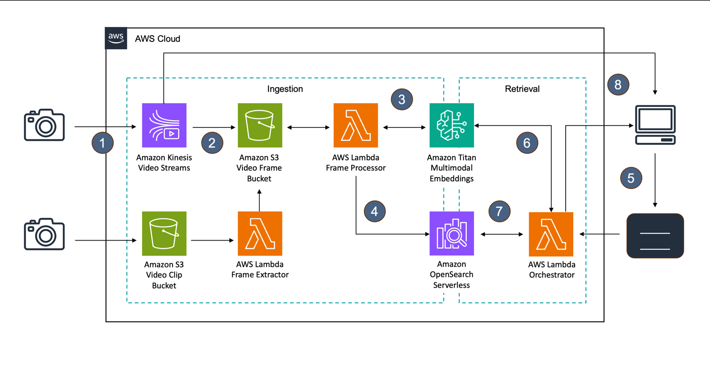
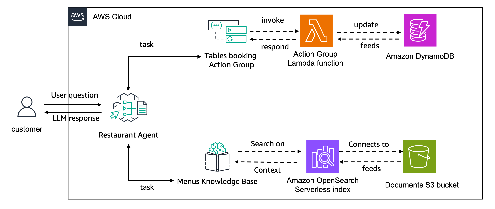
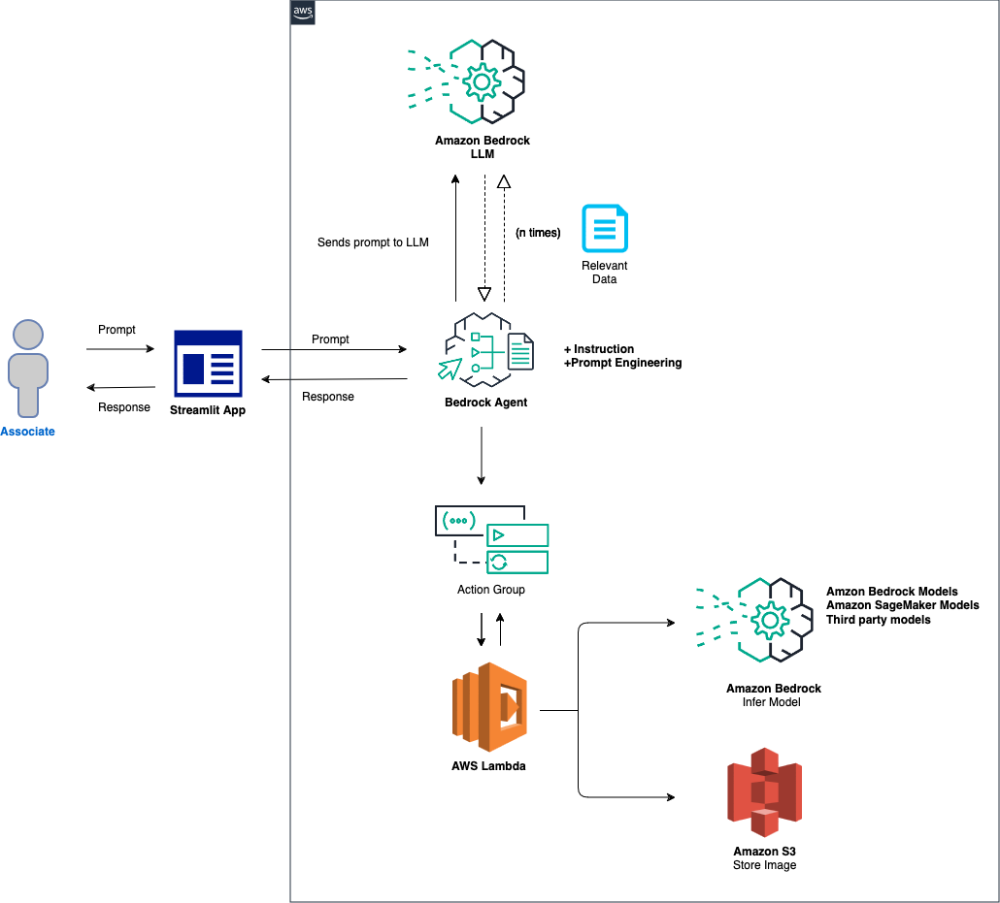

# elvtr AI Solution Architect Certification

## Description

This repo hosts all the assignments, tests and notes taken from the [elvtr AI Solution Architect Certification](https://uk.elvtr.com/course/ai-solutions-architecture) from beggining of 2025.

## Additional resources

## Search an image or video

https://github.com/aws-samples/Serverless-Semantic-Video-Search-Vector-Database-and-a-Multi-Modal-Generative-Al-Embeddings-Model



### Bedrock agents

#### Create a Bedrock agent with action group

http://github.com/aws-samples/amazon-bedrock-workshop



#### Create Bedrock agent with other models

https://github.com/build-on-aws/bedrock-agents-infer-models



---

## Sync the Fork with the Original Git Repository

```sh
# Add a new remote upstream repository
git remote add upstream https://github.com/toby-fotherby/elvtr-ai-solution-architect.git

# Sync your fork
git fetch upstream
git merge upstream/master
```
