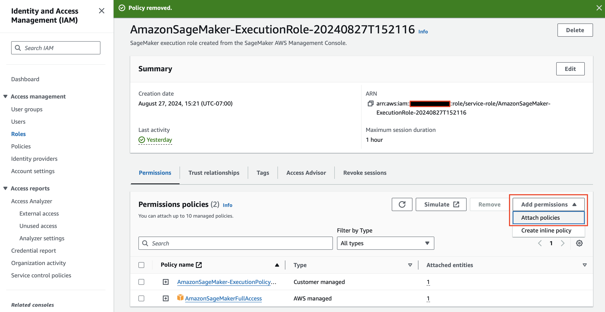
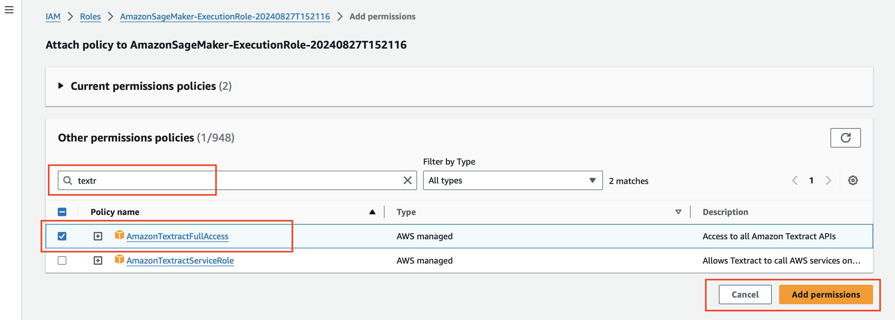

# Pre-requisite for running the assignment

## Adding permissions to your  SageMaker Execution Role

You need to set up the additional permissions for your SageMakerExecutionRole for the IDP assignment.
the following screenshots should help (if you haven't completed this task already). 

To do this, go to the IAM console and select your SageMakerExecutionRole. 
This is the role that you need to add the permissions to.
Your role name will be something along the lines of AmazonSageMaker-ExecutionRole-2024{MMDDTHHMMSS}.
Select this role in the IAM console, then select the option "Add Permissions"/"Attach Policies" as shown in the image here: 

This screenshot show how to add the AmazonTextracFullAccess Policy. 
Note the use of the "textr" to reduce the policy options. 
Select the target policy and then select "Add permissions". 

Repeat this process to add the ComprehendFullAccess policy.

*Note: Without these updates running the notebooks will fail with permission errors*

